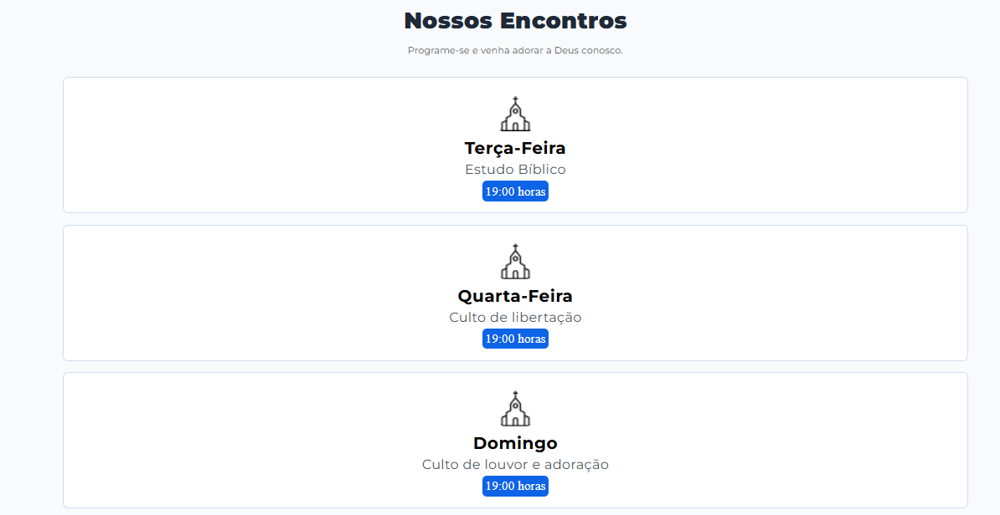
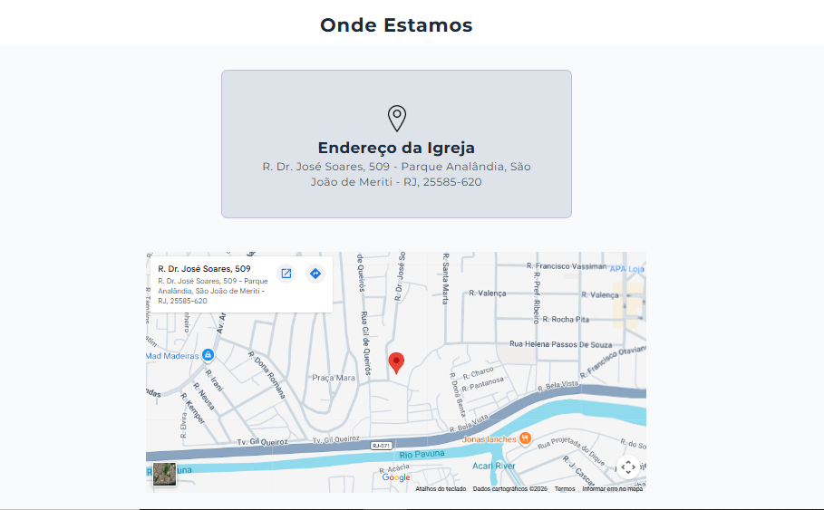

# 🙏 Assembleia de Deus Canal Meriti

<p align="center">
  
</p>

<p align="center">
  <strong>Um website institucional desenvolvido para apresentar a Assembleia de Deus Canal Meriti de forma simples, moderna e acolhedora.</strong>
</p>

<p align="center">
  
  
  
</p>

---

# 📖 Sobre o projeto

Este projeto foi desenvolvido com o objetivo de criar uma página institucional para a **Assembleia de Deus Canal Meriti**, oferecendo uma maneira prática para que visitantes encontrem informações importantes sobre a igreja.

O site foi pensado para transmitir uma identidade visual limpa, moderna e acolhedora, facilitando o acesso às informações principais, como dias de culto, endereço e redes sociais.

Além de servir como um projeto de estudo em desenvolvimento web, este trabalho também possui uma aplicação real, podendo ser utilizado pela igreja para divulgação na internet.

---

# ✨ Funcionalidades

✅ Página totalmente responsiva

✅ Interface simples e intuitiva

✅ Apresentação dos dias de culto

✅ Informações de localização

✅ Mapa integrado com Google Maps

✅ Link direto para o Instagram da igreja

✅ Design moderno utilizando tons de azul

✅ Layout organizado utilizando Flexbox

---

# 📸 Demonstração

## Página Inicial

> Adicione aqui um print da tela inicial.

md


---

## Dias de Culto

> Adicione um print da seção de cultos.

md



---

## Localização

> Adicione um print da seção de localização.

md



---

# 🚀 Tecnologias utilizadas

<p align="left">


</p>

---

# 🎨 Paleta de cores

| Cor | Código |
|------|---------|
| Azul Principal | `#279CF1` |
| Azul Escuro | `#1D4ED8` |
| Branco | `#FFFFFF` |
| Cinza Claro | `#F9FAFB` |
| Cinza Escuro | `#4B5563` |

---

# 📂 Estrutura do projeto

```
📁 projeto
│
├── 📁 assets
│   ├── logo.png
│   ├── instagram.png
│   ├── localizacao.png
│   ├── icone_igreja.png
│   └── ...
│
├── index.html
├── style.css
└── README.md
```

---

# 📚 O que foi praticado neste projeto

Durante o desenvolvimento deste projeto foram colocados em prática diversos conceitos importantes do desenvolvimento Front-end.

- Estruturação semântica com HTML5
- Flexbox
- Responsividade com Media Queries
- Organização de código CSS
- Hierarquia de elementos
- Tipografia utilizando Google Fonts
- Inserção de mapa com Google Maps
- Boas práticas de organização de arquivos
- Efeitos de Hover
- Border Radius
- Box Model
- Espaçamentos internos e externos
- Transições utilizando CSS

---

# 💡 Objetivos do projeto

Este projeto teve como principais objetivos:

- Desenvolver uma interface agradável para visitantes.
- Praticar HTML e CSS na criação de um projeto real.
- Melhorar a organização do código.
- Aplicar conceitos de responsividade.
- Criar um layout intuitivo para dispositivos móveis e computadores.

---

# 📱 Responsividade

O projeto foi desenvolvido seguindo a abordagem **Mobile First**, garantindo uma boa experiência em diferentes tamanhos de tela.

✔ Smartphones

✔ Tablets

✔ Notebooks

✔ Monitores Desktop

---

# 🌎 Possíveis melhorias futuras

- Página "Sobre Nós"
- Página de Ministérios
- Galeria de Fotos
- Área de Eventos
- Formulário de Contato
- Integração com WhatsApp
- Modo Escuro
- Animações com JavaScript
- Menu Mobile

---

# 🛠 Como executar

Clone o repositório:

```bash
git clone https://github.com/SEU-USUARIO/NOME-DO-REPOSITORIO.git
```

Entre na pasta:

```bash
cd NOME-DO-REPOSITORIO
```

Abra o arquivo:

```
index.html
```

Não é necessário instalar nenhuma dependência.

---

# 👨‍💻 Desenvolvedor

Desenvolvido por **Wilson Oliveira**.

Sou estudante de **Análise e Desenvolvimento de Sistemas**, apaixonado por tecnologia e desenvolvimento Front-end. Este projeto faz parte da minha jornada de aprendizado e da construção do meu portfólio.

GitHub:
> https://github.com/wilson385

---

# ⭐ Gostou do projeto?

Se este projeto foi útil para você ou serviu como inspiração, considere deixar uma ⭐ no repositório.

Isso incentiva a continuar desenvolvendo novos projetos e compartilhando conhecimento com a comunidade.

---

<p align="center">
Feito com ❤️, dedicação e muito aprendizado.
</p>